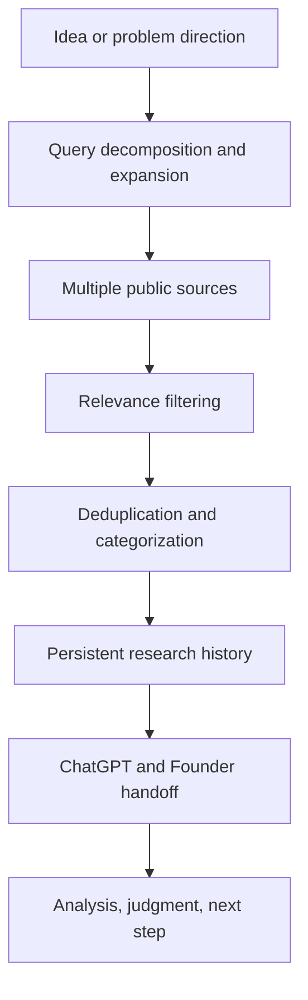
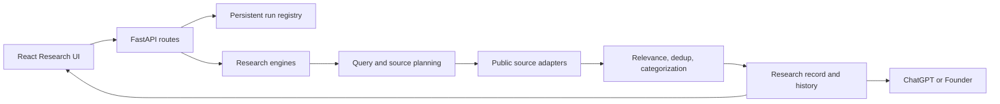

# SignalForge

### 把 AI 討論出的產品想法，轉成可追蹤、可驗證的市場研究紀錄

我在和 AI 討論產品／創業方向時，發現真正麻煩的不是「想不到 idea」，而是每個 idea 後面都有大量分散的論壇、產品、評論、GitHub、文章與研究資料，而且每次對話都很容易重新搜尋、失去來源或混入無關內容。因此我做了 SignalForge，讓系統負責持續蒐集與保存 evidence，再把判斷留給人與 AI。

> **SignalForge = Search + Relevance + Dedup + Categorize + Track + Preserve**  
> **ChatGPT / Human = Research + Analysis + Judgment + Next Step**

**This repository contains the full source code of SignalForge, with secrets, credentials, runtime data, caches and private data excluded.** 完整度與排除規則可由 [Full Source Manifest](FULL_SOURCE_MANIFEST.md) 稽核。

SignalForge 是我持續開發的 research infrastructure / software project，不是「AI 自動預測成功商機」的系統。**Relevance 不等於 validation；search failed 也不等於市場不存在。**

## 我遇到的問題

- 同一個 idea 每次開新對話都可能從頭搜尋，研究成本無法累積。
- 公開資料分散在 discussion、GitHub、general web、reviews、products、articles / research。
- 長句直接做 keyword search，容易漏掉真正使用者會採用的說法。
- 搜到相同字詞，不代表它回答了同一個問題。
- 同一事件的轉貼或同一 URL 的不同形式，會製造「很多 evidence」的錯覺。
- browser refresh 或切頁不應重跑 research，也不應丟失進度。
- timeout、blocked 或 0 results，都不能被誤譯為「沒有需求」。

## SignalForge 怎麼解

1. **Query decomposition**：把母方向拆成 actor、platform、failure、workaround、source facets。
2. **Multi-source research**：從 public discussions、GitHub、general web、reviews、products、articles / research 收集候選材料。
3. **Relevance filtering**：把 exact、related、counterevidence 與 noise 分開。
4. **Deduplication**：正規化 URL、比對內容與事件 identity，避免重複計數。
5. **Categorization**：整理成 human conversation、solution、published material、counterevidence 等研究 lane。
6. **Persistent research**：backend 用 `run_id` 保存工作狀態；UI 只 reconnect / read status。
7. **Research history**：保留 `first_seen`、source、URL、search trace、`seen_count` 等欄位。
8. **Human/AI handoff**：SignalForge 整理材料，最後比較、判斷與下一步交給 ChatGPT / Founder。

## 核心流程





更完整的元件責任、資料流與 failure semantics 請見 [Architecture](docs/ARCHITECTURE.md)；研究判讀原則見 [Research Method](docs/RESEARCH_METHOD.md)。

## 工程重點

### Query decomposition

使用者描述常混合角色、情境、痛點與解法。系統產生多個有辨識力的 facets，避免把整段文字直接塞進單一搜尋框。

### Relevance filtering

retrieval 與 relevance 是兩層工作。像遊戲 issue 或不相干的 GitHub issue，可能剛好包含 URL、GPT 或 upload 等字樣；SignalForge 不讓字面命中直接升格為 market evidence。

### Deduplication

相同文章被轉貼到不同平台，不能算成多個獨立事件。系統結合 URL canonicalization、內容 fingerprint 與 identity 判定，並以 `seen_count` 保存再次觀察的歷史。

### Persistent runs

research run 屬於 backend，不屬於 browser component。`POST start` 建立或重用 `run_id`；refresh 後 UI 重新讀取同一 run，避免重複啟動昂貴工作。

### Failure semantics

- `SEARCH FAILED != NO MARKET SIGNAL`
- `0 results != no demand`
- `source blocked != no evidence exists`

transport failure、coverage 與 evidence conclusion 被分開保存。詳見 [Limitations](docs/LIMITATIONS.md)。

## 實際案例

研究假設：**AI users struggle to give public links to their AI and keep the conversation going.**

ChatGPT、Claude 等 AI 在讀 YouTube、TikTok、Instagram、Reddit、X、GitHub、一般網頁或 PDF 的公開連結時，可能遇到 access、extraction 或 context 問題。使用者因而採用 copy-paste、transcript、download/upload、browser extension、scraper、MCP 或換模型等 workaround。

SignalForge 對此方向會拆解 facets、保存來源與 search trace、過濾表面關鍵字命中、合併重複轉貼，並把 exact、related、counterevidence 與 search failure 分開交接。**這只是 research hypothesis，不是已驗證的市場結論。**

## Quick Start

### Prerequisites

- Python 3.11+
- Node.js 20+
- PostgreSQL 與 Redis（可使用 `docker-compose.yml`）
- 外部來源所需 API key；未設定時，對應 adapter 會呈現 unavailable / pending credential，不應被解讀成 no demand

將安全範本複製為本機設定後再填入自己的值；不要 commit `.env`：

```bash
cp .env.example .env
```

### Backend

```bash
python -m venv .venv
# Windows: .venv\Scripts\activate
# macOS/Linux: source .venv/bin/activate
pip install -r requirements.txt
docker compose up -d postgres redis
uvicorn api.main:app --reload --host 0.0.0.0 --port 8000
```

Backend entrypoint：`api/main.py`（FastAPI app：`api.main:app`）。資料庫初始化可執行 `python init_db.py`。

### Frontend

```bash
cd dashboard
npm install
npm run dev
```

Frontend entrypoint：`dashboard/src/main.tsx`；Vite 設定在 `dashboard/vite.config.ts`。

### Representative checks

本 repo 保留完整的 root-level smoke / acceptance / regression scripts，例如：

```bash
python run_signalforge_tracking_research_persistence_v2_5_3_smoke.py
python run_signalforge_r8_idea_research_recall_fix5_acceptance.py
python run_signalforge_research_backlog_v1_acceptance.py
```

需要 live API 或已啟動 backend 的測試，會在檔名或輸出中標示；執行前請先設定相應 prerequisite。完整 demo 路徑見 [Demo Guide](docs/DEMO.md)。

## Repository Structure

以下依實際 export 後的 root directories 整理：

```text
SignalForge/
├── agents/          # agent definitions and analysis workers
├── api/             # FastAPI app, routes, schemas and persistence middleware
├── benchmarks/      # source-controlled benchmark inputs
├── config/          # safe configuration and source registries
├── dashboard/       # React + TypeScript + Vite frontend
├── database/        # database connection and models
├── docs/            # architecture, research contracts, migrations and demo docs
├── processors/      # research, relevance, dedup, evidence and decision pipelines
├── scheduler/       # scheduled jobs
├── scrapers/        # public-source collectors and adapters
├── simulation/      # simulation support
├── *.py             # backend entrypoints, run scripts, smoke and regression tests
├── .env.example     # credential names only; no real values
├── docker-compose.yml
├── requirements.txt
├── FULL_SOURCE_MANIFEST.md
└── README.md
```

Frontend dependency/build files包括 `dashboard/package.json`、`dashboard/package-lock.json`、TypeScript config、Vite config 與完整 `dashboard/src/`。Python dependencies 位於 `requirements.txt` 與 `requirements-signalforge-chatgpt.txt`。

## Current Status / Limitations

本 repository 包含 production working tree 中的完整 current source，包括尚未提交但屬於實際系統的 source files；不包含 secrets、credentials、runtime database、cache、logs、私人資料、rollback backups、installer/export packages 或 generated result bundles。

公開原始碼能證明系統已落到 backend、frontend、source adapters、research logic、persistence、tracking 與 tests，但不代表所有外部來源隨時可連線，也不宣稱使用者數、營收、準確率或已驗證市場成果。完整限制見 [Limitations](docs/LIMITATIONS.md)。
