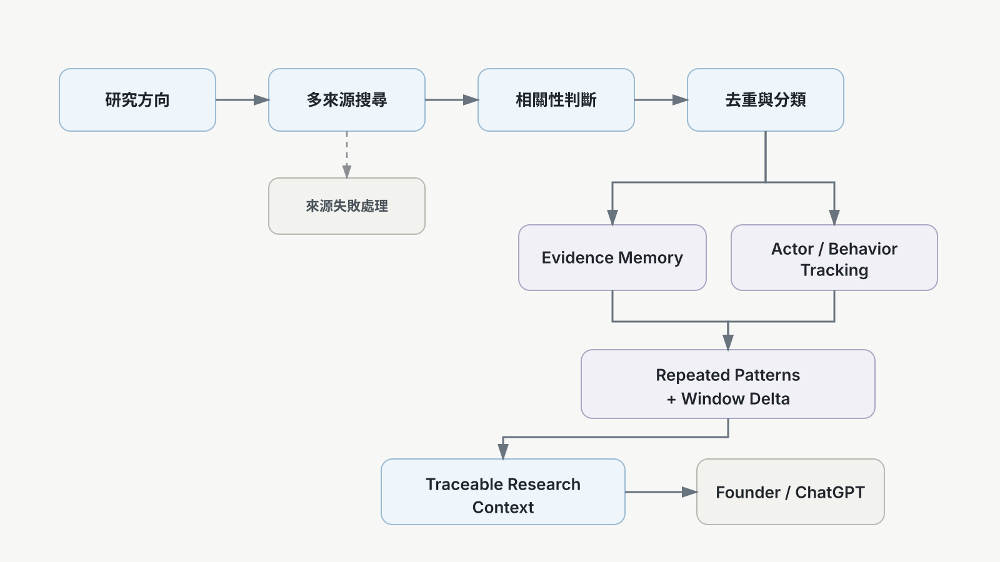

# SignalForge

**持續市場研究與行為情報系統**

SignalForge 是我為了長期研究產品方向與真實使用者行為而做的系統。它不替人下「這個市場成立／不成立」的結論，而是持續從公開來源搜尋、判斷相關性、去重、分類、保存並追蹤 evidence，再把可追溯的 context 交給 Founder / ChatGPT 做後續分析與決策。

> **SignalForge = Search + Relevance + Dedup + Categorize + Track + Preserve**  
> **Founder / ChatGPT = Research + Analysis + Judgment + Next Step**

目前本機研究工作區已累積 **203 個研究方向**，並持續保存材料、來源、行為、workaround、產品提及、公開人物與時間變化。

---

## 為什麼做 SignalForge

一開始我想做的是「讓 AI 自動找出值得做的商機」。

真正跑過大量資料後，我遇到的問題反而不是 AI 不會分析，而是它很容易把不確定的東西分析得像真的，例如：

- 同一來源被當成多份獨立 evidence
- 關鍵字相似被誤當成需求成立
- 搜尋失敗被誤解成「市場不存在」
- evidence 綁錯 actor / context
- 一次性的搜尋無法累積成長期市場記憶

因此 SignalForge 後來把重點從「自動判斷商機」改成 **evidence-first research infrastructure**。

核心原則是：

- relevance 不等於 validation
- search failed 不等於 no market
- repeated behavior 可以是 evidence，但不是 verdict
- counterevidence 必須和 supporting evidence 一起保存
- tracking system 不得自行寫入市場成立／不成立的結論

目前系統維持：

`market_truth_writes = 0`

---

## 現在 SignalForge 在做什麼

### 1. Research Directions

使用者先建立想研究的產品方向、問題或市場假設。

系統保存方向本身，不要求先證明它是「好機會」。

### 2. Multi-source Search

依研究方向拆出 actor、workflow、workaround、product、switching、category language 等查詢角度，從多種公開來源取得材料，例如：

- public discussions
- Reddit / forums
- GitHub / Hacker News
- general web
- products / competitors
- articles / research
- B2B / job / procurement signals

### 3. Relevance + Dedup

搜尋結果不會直接被視為市場證據。

SignalForge 會先做：

- relevance classification
- URL normalization
- duplicate / same-event detection
- source-family categorization
- provenance preservation

### 4. Behavior Tracking

市場需求不一定會以「抱怨」出現。

SignalForge 也會追蹤：

- recurring workflows
- manual workarounds
- product mentions
- switching behavior
- repeated actors
- category language

### 5. Actor Continuity

針對公開來源中的 actor，系統可保存：

- platform / handle
- first seen / last seen
- observation count
- workflows
- workarounds
- product mentions
- public contact path

identity matching 採保守策略，不做私人身份解析。

### 6. Repeated Patterns + Window Delta

同一研究方向內，系統會觀察跨 actor 重複出現的 pattern。

目前 repeated pattern 預設需要至少 **3 個 independent actors** 才浮出。

同時比較：

- last 7d vs previous 7d
- last 30d vs previous 30d

這些數字只描述變化，不直接等同市場成長或需求成立。

---

## 核心流程



---

## 架構重點

### Persistent Research

Browser 不是 research job owner。

單一方向研究使用 persisted run state：

- duplicate click reuse active run
- browser refresh 可 reconnect
- navigation 不會重啟同一份研究
- global tracking 暫停時，單一方向仍可手動研究

### Dockerless Local Mode

SignalForge 現在預設可直接使用本機 `.radar_runtime` 的 persistent research state。

**Docker / PostgreSQL / Redis 不再是開啟 Research Workspace 的必要條件。**

PostgreSQL / Redis 保留為 legacy / optional infrastructure。

### Read-only Dashboard Path

Dashboard 的 list / detail GET 使用 read-only fast path：

- 不因為開頁面而跑 migration
- 不因 GET 重寫 canonical research store
- list / detail 使用 cache
- canonical research state 仍由 mutation / research path 管理

---

## Tech Stack

**Backend**

- Python
- FastAPI
- file-backed persistent research state
- optional PostgreSQL / Redis legacy stack

**Frontend**

- React
- TypeScript
- Vite

**Research / Data**

- multi-source adapters
- relevance filtering
- deduplication
- persistent history
- actor continuity
- behavior extraction
- repeated-pattern detection
- rolling-window deltas

---

## Quick Start

### Backend

```bash
python -m venv venv

# Windows
venv\Scripts\activate

pip install -r requirements.txt
python -m uvicorn api.main:app --host 0.0.0.0 --port 8000
```

預設為 local mode，不需要先啟動 Docker。

若要使用 legacy PostgreSQL stack，可自行設定：

```bash
SIGNALFORGE_STORAGE_MODE=postgres
```

### Frontend

```bash
cd dashboard
npm install
npm run dev
```

預設開啟：

`http://localhost:5173/`

---

## Repository Structure

```text
SignalForge/
├── api/                 # FastAPI routes and runtime boundaries
├── processors/          # research, relevance, tracking and behavior logic
├── dashboard/           # React + TypeScript research workspace
├── scrapers/            # public-source collectors and adapters
├── config/              # configuration and source policies
├── database/            # optional legacy database layer
├── scheduler/           # scheduled jobs
├── benchmarks/          # benchmark fixtures
├── tests/
│   └── history/         # preserved historical acceptance / regression evidence
├── scripts/
│   └── history/         # preserved historical experiment / audit runners
├── assets/              # portfolio diagrams
├── docs/                # architecture, demo, limitations and repository audit
├── requirements.txt
└── README.md
```

目前 canonical product path 是 `api/`、`processors/`、`dashboard/`。root 只保留仍有 runtime/import contract 的 entrypoints、operational scripts，以及少量目前仍代表系統邊界的 regression checks。歷史測試與實驗腳本沒有刪除，而是移到 `tests/history/` 與 `scripts/history/`。完整整理原則見 [Repository Audit](docs/REPOSITORY_AUDIT.md)。

---

## Representative Checks

```bash
python run_signalforge_behavior_tracking_v1_regression.py
python run_signalforge_tracking_research_persistence_v2_5_3_smoke.py
python run_signalforge_dockerless_local_mode_regression.py
python run_signalforge_dockerless_readpath_fix_v1_regression.py
```

測試重點包括：

- persistence
- single-item research
- actor continuity
- repeated pattern threshold
- rolling windows
- Dockerless local mode
- read-only list/detail path
- `market_truth_writes = 0`

---

## 專案演進

SignalForge 的方向不是一開始就正確。

```text
自動商機評分
    ↓
Evidence-first research
    ↓
Continuous Tracking
    ↓
Behavior + Trend Intelligence
```

這個專案最重要的學習不是「讓 AI 更會選商機」，而是：

> **先把 evidence、來源、行為與時間變化保存好，再讓人與 AI 做判斷。**

---

## Limitations

SignalForge 是 research infrastructure，不是市場預測器。

- 公開來源 coverage 永遠不完整
- relevance 可能有 false positive / false negative
- repeated mentions 不代表 willingness to pay
- product mentions 不代表 brand vacuum
- source failure 不代表 no demand
- behavior tracking 不代表因果關係
- 系統不宣稱能預測商業成功

詳細說明見 [Limitations](docs/LIMITATIONS.md)。

---

## More

- [Architecture](docs/ARCHITECTURE.md)
- [Demo Guide](docs/DEMO.md)
- [Limitations](docs/LIMITATIONS.md)
