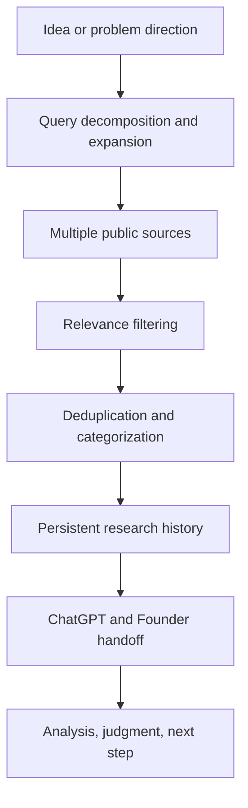
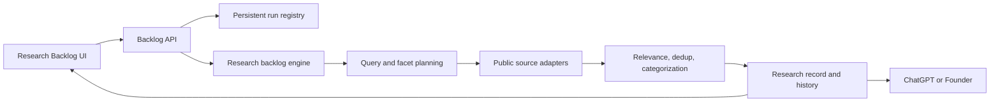

# SignalForge

### 把 AI 討論出的產品想法，轉成可追蹤、可驗證的市場研究紀錄

我在和 AI 討論產品／創業方向時，發現真正麻煩的不是「想不到 idea」，而是每個 idea 後面都有大量分散的論壇、產品、評論、GitHub、文章與研究資料，而且每次對話都很容易重新搜尋、失去來源或混入無關內容。因此我做了 SignalForge，讓系統負責持續蒐集與保存 evidence，再把判斷留給人與 AI。

> **SignalForge = Search + Relevance + Dedup + Categorize + Track + Preserve**  
> **ChatGPT / Human = Research + Analysis + Judgment + Next Step**

SignalForge 是我持續開發的 research infrastructure / software project，不是「AI 自動預測成功商機」的系統。**Relevance 不等於 validation；search failed 也不等於市場不存在。**

## 專案簡介

SignalForge 把一個仍然模糊的產品方向，轉成具有來源、搜尋軌跡、分類、時間與狀態的 research record。它處理的是「研究資料怎麼被可靠地找到、整理、保存與交接」，而不是替 founder 宣布一個市場已被證實。

這個公開 repository 是從完整開發環境中整理出的作品展示版。它刻意只收錄能說明系統設計的 current source、代表性測試與文件，不是 production mirror。

## 我遇到的問題

- 同一個 idea 每次開新對話都可能從頭搜尋，研究成本無法累積。
- 公開資料分散在 discussion、GitHub、一般網頁、review、product 與 article / research。
- 長句直接做 keyword search，容易漏掉真正使用者會採用的說法。
- 搜到含有相同字詞的內容，不代表它回答了同一個問題。
- 同一事件的轉貼或同一 URL 的不同形式，會製造「很多 evidence」的錯覺。
- browser refresh 或切頁不應重跑 research，也不應丟失進度。
- 來源 timeout、blocked 或回傳 0 筆，都不能被誤譯為「沒有需求」。

## SignalForge 怎麼解

1. **Query decomposition**：把母方向拆成 actor、platform、failure、workaround、source facets。
2. **Multi-source research**：對 public discussions、GitHub、general web、reviews、products、articles / research 建立不同搜尋路徑。
3. **Relevance filtering**：把 exact、related、counterevidence 與 noise 分開，避免字面命中被升格為證據。
4. **Deduplication**：正規化 URL、比對內容與事件 identity，避免重複計數。
5. **Categorization**：把結果放入 human conversation、solution、published material、counterevidence 等研究 lane。
6. **Persistent research**：backend 以 `run_id` 保存工作狀態；UI 只 reconnect / read status。
7. **Research history**：保留 `first_seen`、source、URL、search trace、`seen_count` 等欄位，讓研究可以累積。
8. **Human/AI handoff**：輸出有邊界的 research record，最後的比較、判斷與下一步交給 ChatGPT / Founder。

## 核心流程



重要邊界：SignalForge 可以指出「找到哪些材料、為何相關、哪裡失敗、還缺什麼」，但不能只因為找到材料就宣稱需求或商機成立。

## 系統架構



更完整的元件責任、資料流與 failure semantics 請見 [Architecture](docs/ARCHITECTURE.md)。

## 主要工程挑戰

### 長方向不等於好 query

使用者描述通常混合角色、情境、痛點與解法。系統需要產生多個有辨識力的 facets，而不是把整段文字塞進單一關鍵字搜尋。

### 搜到不等於相關

例如遊戲 issue 或不相干的 GitHub issue，可能剛好同時包含 URL、GPT 或 upload 等字樣。SignalForge 將 retrieval 與 relevance 分開，並保留分類理由，避免把 noise 當成 market evidence。

### 多來源不等於多份獨立證據

相同文章被轉貼到不同平台，不能被當成多個獨立事件。URL canonicalization、內容 fingerprint 與 identity 判定會先合併重複項目。

### UI lifecycle 不等於 research lifecycle

研究 run 屬於 backend。`POST start` 會建立或重用 `run_id`，refresh 後 UI 以 ID 重新讀取狀態，不因 component remount 重複啟動昂貴工作。

### 失敗需要誠實的語意

- `SEARCH FAILED != NO MARKET SIGNAL`
- `0 results != no demand`
- `source blocked != no evidence exists`

因此 transport failure、source coverage 與 evidence conclusion 被分開保存。詳細原則見 [Research Method](docs/RESEARCH_METHOD.md) 與 [Limitations](docs/LIMITATIONS.md)。

## 實際案例

研究假設：**AI users struggle to give public links to their AI and keep the conversation going.**

背景是 ChatGPT、Claude 等 AI 在讀取 YouTube、TikTok、Instagram、Reddit、X、GitHub、一般網頁或 PDF 的公開連結時，可能遇到 access、extraction 或 context 問題。使用者因此採用 copy-paste、transcript、download/upload、browser extension、scraper、MCP 或換模型等 workaround。

SignalForge 對這個方向的工作不是直接回答「值得做嗎」，而是：

- 拆出 platform、content type、failure mode、workaround 與 source facets；
- 找到原始討論、產品與技術材料，保存 URL 和 search trace；
- 過濾僅有表面關鍵字重疊的內容；
- 合併同一事件的重複轉貼；
- 把 exact、related、counterevidence 與 search failure 分開呈現；
- 交由 ChatGPT / Founder 比較問題頻率、替代方案、付費意願與下一個驗證行動。

**這只是 research hypothesis，不是已驗證的市場結論。**

## 我從這個專案學到什麼

- Research system 最重要的不只是抓更多資料，而是保存 provenance 與 truth boundary。
- Retrieval quality 與 judgment quality 是兩個不同問題，不能用一個總分掩蓋。
- Failure state 本身也是研究資料；如果不保存，使用者很容易把工具限制誤認為市場結論。
- Persistent run 與 idempotency 是 research UX 的一部分，不只是 backend optimization。
- 好的 human/AI handoff 應該同時提供 evidence、反證、缺口與可追溯來源。

## Current Status / Limitations

目前 repository 展示了研究 backlog、query / source orchestration、relevance 邏輯、持久化 run middleware、React UI 與 regression / smoke tests。它能證明核心工程已落到程式碼，而不是只有概念圖。

公開版不附 production deployment、私有 runtime data、憑證或完整內部模組；部分來源也會因 rate limit、登入牆、robots policy、頁面改版或區域限制而失敗。相關性規則仍可能有 false positive / false negative，dedup 也無法保證辨識所有跨平台轉貼。完整限制見 [Limitations](docs/LIMITATIONS.md)。

## Demo 流程

1. 輸入一個 problem direction。
2. 檢查系統產生的 query facets 與預定來源。
3. 啟動 research，取得 `run_id`。
4. refresh / reconnect，確認同一個 run 被讀回而非重跑。
5. 檢查結果的 relevance、category、URL、search trace、first seen 與 seen count。
6. 查看 failed / blocked source 是否被呈現為 coverage gap，而不是「無市場」。
7. 將整理後 record 交給 ChatGPT / Founder 做分析與下一步判斷。

可重現的 persistence smoke test：

```bash
python tests/research_persistence_smoke.py
```

代表性的 relevance regression（使用固定 fixture，不呼叫外部網路）：

```bash
python tests/research_relevance_regression.py
```

詳細操作與預期畫面見 [Demo Guide](docs/DEMO.md)。

## Repository Structure

```text
SignalForge/
├── README.md
├── docs/
│   ├── ARCHITECTURE.md
│   ├── RESEARCH_METHOD.md
│   ├── LIMITATIONS.md
│   └── DEMO.md
├── src/
│   ├── api/
│   │   ├── signalforge_research_backlog.py
│   │   └── signalforge_research_persistence.py
│   ├── processors/
│   │   ├── signalforge_research_backlog.py
│   │   ├── signalforge_founder_idea_loop.py
│   │   ├── signalforge_source_expansion.py
│   │   ├── signalforge_source_adapters.py
│   │   ├── signalforge_source_registry.py
│   │   ├── signalforge_founder_query_contracts.py
│   │   └── signalforge_founder_hypothesis_registry.py
│   └── dashboard/
│       ├── ResearchBacklog.tsx
│       ├── researchBacklog.ts
│       └── researchPersistence.ts
└── tests/
    ├── research_persistence_smoke.py
    └── research_relevance_regression.py
```

本 repo 的 source 是完整開發 repo 的精選切面；檔名已去除維護版號，讓讀者把注意力放在 current architecture 與可驗證的工程決策。
