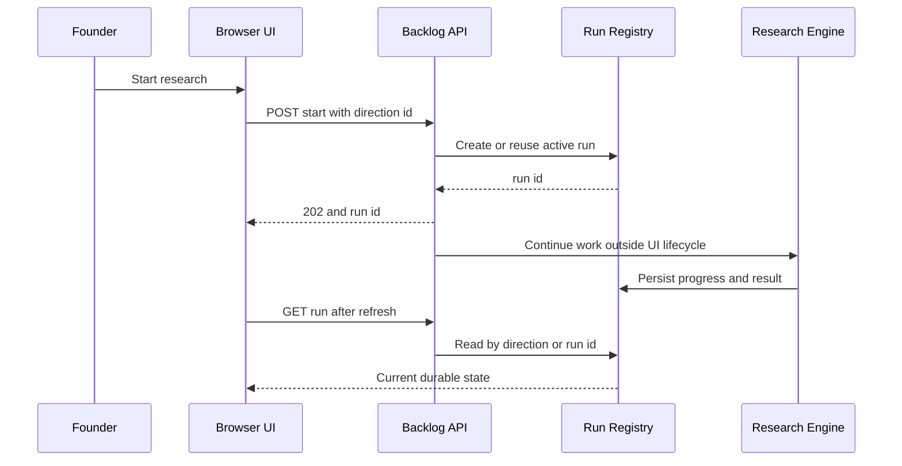
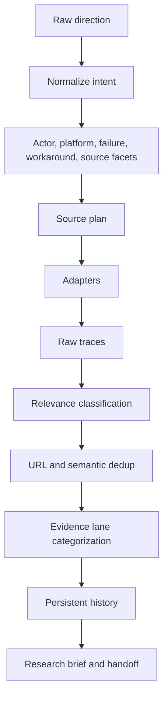
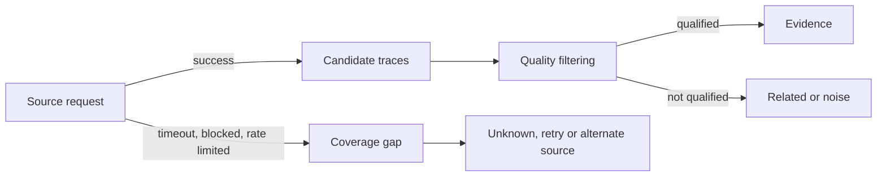

# Architecture

## 設計目標

SignalForge 的系統責任是讓一個尚未驗證的產品方向，經過可追蹤的搜尋與整理後，成為可供人與 AI 繼續分析的 research record。架構刻意把「蒐集／保存」與「判斷／決策」分開。

## 元件責任

| 元件 | 責任 | 不負責 |
|---|---|---|
| Research Backlog UI | 建立方向、顯示 run 狀態、研究材料與缺口 | 在 browser 內執行長時間研究 |
| Backlog API | 驗證 request、啟動或讀取 research run、序列化結果 | 把 transport 成功當成市場驗證 |
| Persistence middleware | 建立 `run_id`、idempotency、保存狀態、reconnect | 評斷 idea 好壞 |
| Research engine | query planning、source dispatch、結果整合 | 隱藏來源失敗 |
| Source expansion | 依 source 能力與成本政策選擇 adapter | 宣稱 coverage 完整 |
| Quality layer | relevance、dedup、category、counterevidence | 以單一分數取代人工判斷 |
| Research history | 保存 provenance、first seen、seen count、trace | 儲存私人客戶資料於公開 repo |
| ChatGPT / Founder | 分析、比較、判斷、下一步 | 假裝未取得的 evidence 已存在 |

## Request 與 run lifecycle

同一方向已有 active run 時，start request 應重用既有 `run_id`。這個 idempotency boundary 防止雙擊、refresh、React remount 或多個 browser tab 重複觸發研究。

## Research pipeline

### Multi-source research

不同來源回答不同問題：discussion 偏向人類語境，GitHub 可呈現實作與 issue，general web 提供廣度，review 與 product 呈現既有替代方案，article / research 提供背景或反證。來源數量本身不是 evidence strength；系統仍須辨識它們是否獨立、是否直接回答 hypothesis。

### Relevance boundary

Retrieval 先找候選材料，relevance layer 再判斷材料與 hypothesis 的關係。至少區分：

- exact / core：直接描述同一 actor、failure 與 context；
- related：鄰近問題，可協助理解但不能冒充核心 evidence；
- counterevidence：可能削弱或推翻 hypothesis；
- noise：只有詞彙重疊，沒有相同問題 identity。

### Dedup boundary

系統先正規化 URL（例如移除 tracking parameter），再搭配內容 fingerprint 與事件 identity。`seen_count` 可以增加，但同一內容不因此變成多份獨立 evidence。

### Persistence boundary

Browser 是 view，不是 job owner。run registry 保存 queued、running、succeeded、failed、cancelled 或 timed out 等狀態；寫入採原子替換思路，避免 process 中斷留下半份 JSON。

## Failure semantics

Transport status、coverage status 與 research conclusion 是三層不同資訊：

因此 `FAILED` 表示這次 request 沒完成，不表示市場沒有 signal；`SUCCESS + 0` 也只表示這個 query / source / time window 沒找到結果。

## Source map

- `api/main.py` 與 `api/routes/`：FastAPI entrypoint、routing 與 request / response boundary。
- `api/signalforge_research_persistence_v253.py`：durable run、idempotency、reconnect。
- `processors/signalforge_research_backlog.py`：backlog state、quality gate、history。
- `processors/signalforge_founder_idea_loop.py`：query bridge、source retrieval、relevance 與 brief 組裝。
- `processors/signalforge_source_expansion.py`：source portfolio 與 multi-query dispatch。
- `processors/signalforge_source_adapters.py` 與 `signalforge_source_registry.py`：公開來源 adapter、能力與 runtime state。
- `processors/` 其餘模組：evidence、opportunity、discovery、validation、runtime 與 calibration pipelines。
- `scrapers/`：public-source collectors 與 source network adapters。
- `dashboard/src/`：完整 React UI、API client 與 research persistence client。
- root-level `run_*.py` / `show_*.py`：smoke、acceptance、regression、audit 與操作 scripts。
