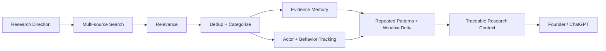
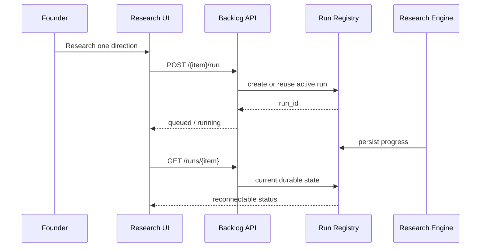

# Architecture

## System Boundary

SignalForge 的責任是：

`Search + Relevance + Dedup + Categorize + Track + Preserve`

Founder / ChatGPT 的責任是：

`Research + Analysis + Judgment + Next Step`

系統刻意不把「蒐集到 evidence」等同於「市場成立」。

---

## Main Flow

---

## Core Components

| Component | Responsibility |
|---|---|
| Research Workspace | directions, list/detail view, manual research, tracking state |
| Backlog API | list/detail/run/trend import boundaries |
| Persistent Run Registry | durable run state, idempotency, reconnect |
| Research Engine | query fanout, retrieval, source dispatch |
| Relevance Layer | DIRECT / POSSIBLY_RELATED / noise filtering |
| Dedup Layer | canonical URL, event/content dedup |
| Material Library | preserve source, provenance and history |
| Actor Continuity | public actor observations across time |
| Behavior Tracking | workflow, workaround, switching, mentions |
| Repeated Patterns | cluster recurring behavior across independent actors |
| Window Delta | 7d / 30d descriptive change |
| Founder / ChatGPT | analysis and judgment |

---

## Behavior Tracking

Evidence kinds include:

- PROBLEM
- WORKAROUND
- BEHAVIOR
- PRODUCT_MENTION
- CATEGORY_LANGUAGE
- COMPETITOR
- TREND
- SWITCHING
- PURCHASE_SIGNAL
- CONTACT_PATH
- COUNTEREVIDENCE
- OTHER

Behavior evidence does not require explicit complaint language.

Example:

`download video → transcribe → paste into AI`

Even without a complaint, repeated workflow can still be relevant behavioral evidence.

---

## Actor Continuity

Public actor state can retain:

- actor key
- platform
- handle
- profile URL
- first seen
- last seen
- observation count
- source URLs
- workflows
- workarounds
- product mentions
- public contact paths

Identity merge is conservative:

- HIGH: exact platform + handle, or canonical profile URL
- MEDIUM: same username + strongly matching profile
- LOW: do not automatically merge

SignalForge does not perform private identity resolution.

---

## Repeated Patterns

Recurring workflows / products / workarounds / category terms are clustered per research direction.

Default surfacing threshold:

`>= 3 independent actors`

This only means a pattern has repeated across independent public actors. It is not a market verdict.

---

## Rolling Windows

SignalForge compares:

- last 7 days vs previous 7 days
- last 30 days vs previous 30 days

Typical descriptive metrics:

- unique actors
- material count
- new material count
- repeat actors
- workaround mentions
- product mentions
- category mentions
- competitor mentions
- switching mentions

The system reports descriptive deltas only.

---

## Persistent Research

Properties:

- duplicate active click reuses run
- refresh does not duplicate execution
- browser navigation can reconnect
- global tracking pause does not block manual single-direction research

---

## Dockerless Local Mode

Current default storage mode is local.

Canonical research state:

`.radar_runtime/founder_opportunity_research_v1.json`

Dashboard list/detail reads use a read-only path.

The read path must not:

- run cumulative migration
- rewrite the canonical store
- trigger research
- write market truth

PostgreSQL / Redis remain optional legacy infrastructure.

---

## Truth Boundary

The tracking layer may write:

- evidence
- counterevidence
- behavior
- actor observations
- source metadata
- window deltas

It must not write:

- market exists
- market does not exist
- good opportunity
- bad opportunity
- validated demand

Current invariant:

`market_truth_writes = 0`

---

## Failure Semantics

`SEARCH FAILED != NO MARKET SIGNAL`

`0 results != no demand`

`source blocked != no evidence exists`

Source failure is coverage metadata, not market truth.

---

## Current Main Paths

- `api/main.py`
- `api/routes/signalforge_research_backlog.py`
- `api/signalforge_research_persistence_v253.py`
- `processors/signalforge_research_backlog.py`
- `processors/signalforge_behavior_tracking.py`
- `processors/signalforge_founder_idea_loop.py`
- `processors/signalforge_source_adapters.py`
- `dashboard/src/pages/ResearchBacklog.tsx`
- `dashboard/src/api/researchBacklog.ts`
